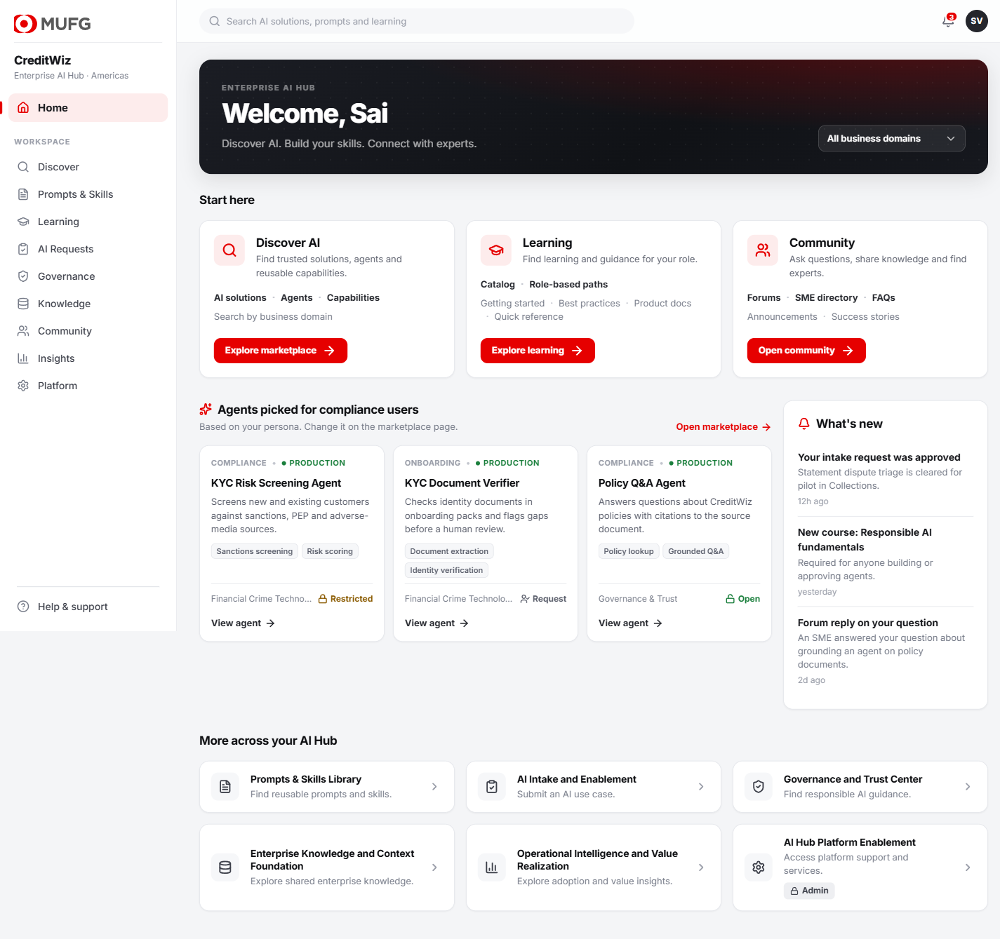
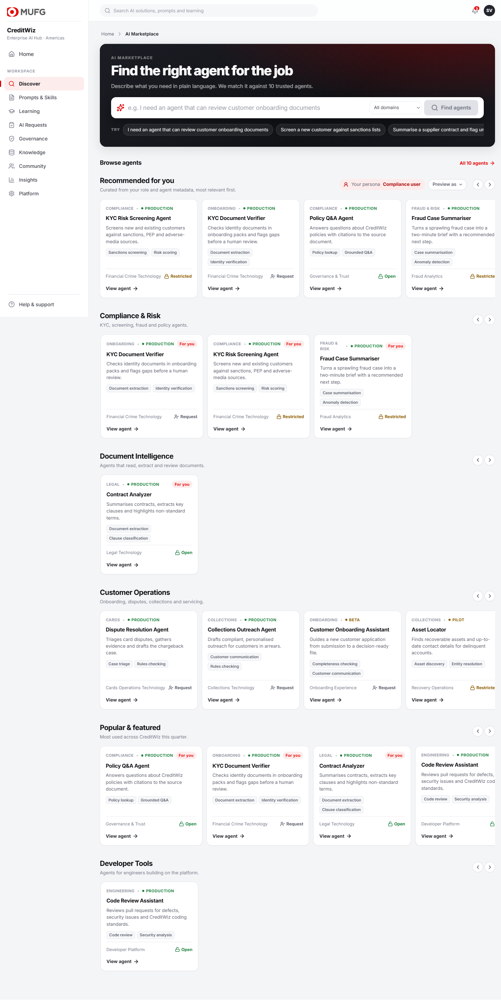
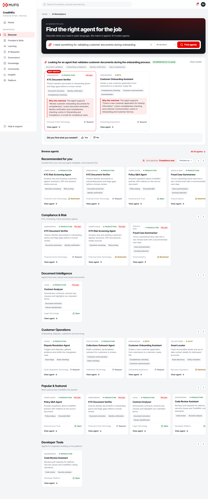
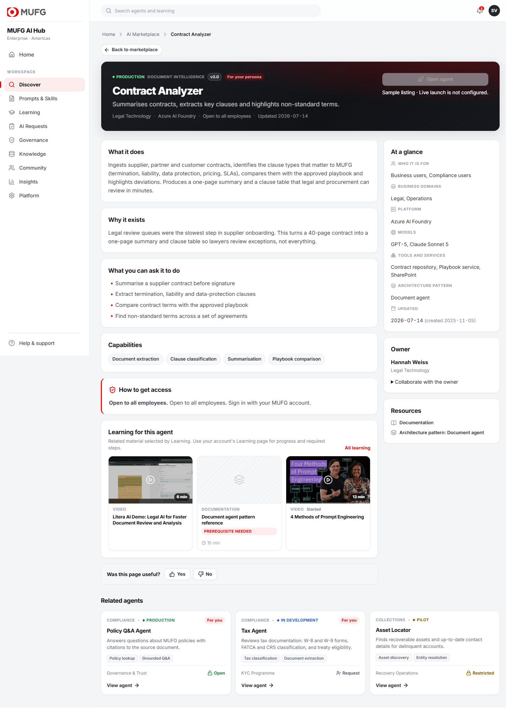
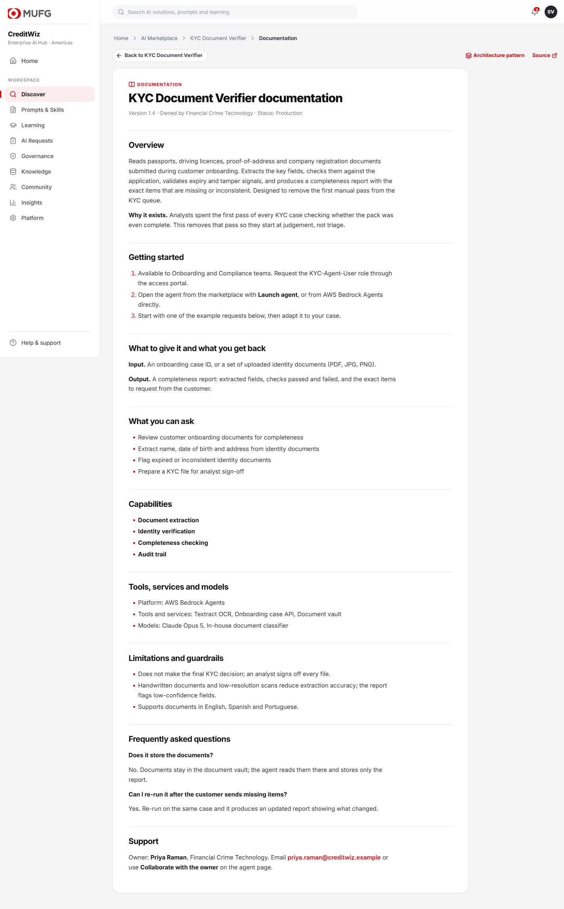
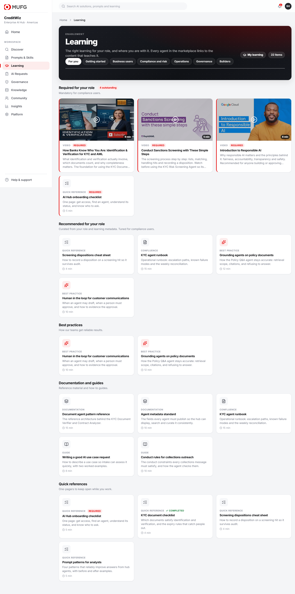
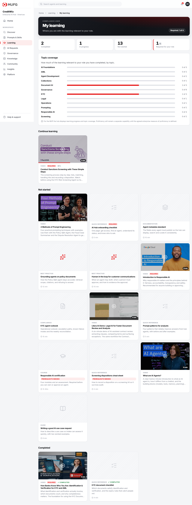
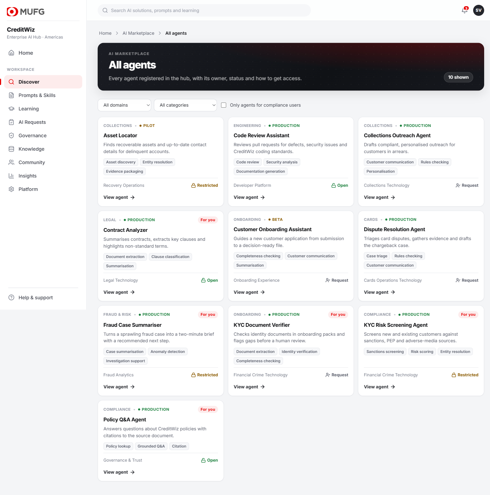

# MUFG — Enterprise AI Hub

Implemented MVP: **AI Marketplace & Discovery**, **Learning**, and shared accounts, permissions and SQLite persistence.

Start with the [MVP completion and operations guide](docs/mvp-completion.md) for the requirement matrix, account setup, migration, validation, and explicit enterprise dependencies.

React frontend, all-Python backend. Ten sample agents, twenty-two learning
items, no external integrations. Search is hybrid — a local ChromaDB semantic
index and a BM25 keyword index, fused by rank — and the whole thing deploys as
a single container.

---

## Read this first

| | |
| --- | --- |
| **Client requirement** | Persona-based discovery now. Relevant, authorised learning for the role, with progress measured. Behavioural, cross-pillar personalisation later. |
| **Our implementation design** | The metadata template, the curation weights, the landing sections, the storage split, and the `/api/context/*` seam. Ours to change, not things that were asked for. |
| **Deliberately not decided by us** | **Proficiency.** The hub displays learning progress and topic coverage. Proficiency remains a separate capability until the agreed enterprise measure is defined. |

For the MVP the metadata source is a **static JSON file**. That keeps the prototype focused on proving discovery, search, curation and the agent-detail experience without integration dependencies. The source can later be replaced by enterprise registries without changing the user experience.

---

## Swim Lane 1 — the problem we set out to solve

> Build a centralised AI Agent Marketplace where employees can easily discover the
> existing enterprise agents through natural-language search and persona-based
> curated discovery, understand each agent's capabilities and supporting
> information with minimal friction, and take an appropriate next action — while
> keeping dynamic behavioural personalisation and live source integrations as
> future phases.

```text
NOW                                   NOT NOW
Marketplace                           Behaviour-learning recommender
Agent catalog                         Cross-pillar personalisation
Natural-language search               Super Agent
Persona-based discovery               Full interaction analytics
Agent details and actions             Live enterprise integrations
Basic feedback
```

### Where each step landed

| # | Confirmed step | Status |
| --- | --- | --- |
| 1 | Get the real list of existing agents | **Open — needs Vinay.** Ten samples in the agreed shape; replacing `agents.json` is the whole integration |
| 2 | Name, description, available metadata | Done, sample set |
| 3 | Common metadata template | Done — two intake formats accepted and normalised |
| 4 | Simple static data for the MVP | Done — JSON is the source of truth |
| 5 | Discovery landing page | Done |
| 6 | Two discovery experiences | Done — search and carousels |
| 7 | Start with universal visibility | Done — ACL present, restricting nothing |
| 8 | Persona-based recommendations | Done — persona derived, never stored |
| 9 | Rich agent detail | Done |
| 10 | Access · Docs · Architecture · Collaborate | Done, all four |
| 11 | Ask whether the user found what they needed | Done |
| 12 | Capture basic footprints | Done — hub-wide, readable trail |
| 13 | Do **not** personalise on them yet | Done — enforced by a test |
| 14 | Later: connect real sources | Not started, by design |
| 15 | Later: cross-pillar adaptive personalisation | Not started, by design |

Twelve of the thirteen "now" steps are built. The outstanding one is an input
from the client, not a build task.

**On attribution:** Ganesh asked for natural-language search and persona-based
curation. The specific mechanisms — a local semantic index, BM25, the fusion
constant, the point weights, the relevance floors — are our implementation
choices. They are tunable decisions, not things that were specified.

---

## Walkthrough

The screenshots below are current. Account selection, catalog filters and
ordered paths are additions the operations guide describes in full.

### 1. Home — one hub, nine pillars



Persona-picked agents and what's new sit under the three priority modules. The persona is **derived** from the directory profile, never stored on it.

### 2. Marketplace — describe what you need



Two discovery paths, as discussed: generative search at the top, Netflix-style carousels below. The Recommended row carries a visible persona badge and an administrator-only "preview as".

### 3. Generative search — and why it matched



> *"I need something for validating customer documents during onboarding"*

Claude restates the request in one line — *"Looking for an agent that validates customer documents during onboarding"* — so the user sees what was understood. That restatement, plus the words they typed, goes to two rankers over the same agent descriptions - a semantic index for meaning, and BM25 for exact names, acronyms and IDs - whose results are fused by rank (Reciprocal Rank Fusion). Anything neither ranker finds convincing is cut rather than padded in. The best match carries a **coverage %**: of the domains and capabilities extracted from the request, how many this agent has. Every result explains itself from the metadata that overlaps the request — not generated prose:

> **Why this matched:** This agent covers identity verification, document extraction and completeness checking, works in Compliance and Onboarding. It is built for compliance users.

No key configured? A local concept lexicon does the same job, and a semantic index over the agent metadata still retrieves agents that share no words with the query. Which engine interpreted the request is recorded in the search footprint rather than shown on the page: users care about the answer, not the plumbing.

### 4. Agent detail — understand, then act



One page answers what it is, why it exists, what to ask it, who owns it, what it runs on, and how to get access. The primary action follows the agent's declared access type: open agents open, request-based agents show the request form, restricted agents route to the owner. Documentation and architecture are one click away. Confirmed enterprise listings also use their configured launch/access URLs and owner email; sample listings explicitly label unavailable live destinations. Related learning is consumed from the Learning pillar.

### 5. Documentation lives in the hub



Every sample agent has in-app reference documentation and an architecture pattern page. Sample external destinations are not presented as live resources.

### 6. Learning — the right content for the role



Required for your role first, then Continue learning, Recommended, Best practices, Documentation and guides, Quick references. Content is not just video: courses, Confluence pages, guides and one-pagers all appear.

### 7. My Learning — progress, not proficiency



Completed, in progress, not started, and required progress. Topic coverage is shown as **counts** ("KYC 1 of 3"), never a percentage dressed up as proficiency. The note on the page states that explicitly.

### 8. The full catalogue



---

## What was asked for, and where it is

| # | Ask | Status |
| --- | --- | --- |
| 1 | Real agent list | 10 **sample** agents in the agreed shape. Replace `backend/data/agents.json` with the real list. |
| 2 | Agent metadata template | [docs/agent-metadata-template.md](docs/agent-metadata-template.md). Seven groups. The simple flat format is accepted too. |
| 3 | Discovery landing page | `/marketplace` |
| 4 | Generative / NLP search | Claude or local lexicon for understanding; hybrid semantic + BM25 retrieval, with explanations |
| 5 | Netflix-style carousels | Six, from `backend/data/carousels.json` |
| 6 | Persona-based curation | Five personas, derived from job title |
| 7 | Agent detail page | Low friction, one page |
| 8 | Actions | Launch · Access · Docs · Architecture · Collaborate |
| 9 | "Did you find what you needed?" | Under search and on every detail page |

**Deliberately not built:** Agent 365, AWS Agent Registry, GitHub, Confluence ingestion, prompt and skill store integrations, dynamic personalisation, Super Agent, cross-pillar recommendations.

A local ChromaDB index *was* added after this list was written — it runs
in-process from a model baked into the image, with no external service. See
[docs/discovery-and-curation.md](docs/discovery-and-curation.md).

---

## How ranking works

Two questions, two mechanisms. Full detail in [docs/discovery-and-curation.md](docs/discovery-and-curation.md).

**Search — "what do you need right now?"** Hybrid retrieval. The typed words plus
Claude's restatement go to two rankers over the same agent text, fused by rank:

```text
audience filter       both retrievers see only agents this user may use
semantic (ChromaDB)   meaning: "AML" finds "sanctions and PEP lists"   top 6
keyword  (BM25)       exact tokens: names, acronyms, IDs               top 6
fusion   (RRF, k=60)  score = sum of 1 / (60 + rank)
relevance gate        keep, or return nothing                        limit 6
```

Rank fusion, not a score blend: a cosine sits in 0–1 and a BM25 score in 0–10,
and blending magnitudes let lexical noise outvote a correct semantic hit. A
relevance gate then decides what is shown, so nonsense returns nothing rather
than the least-bad match. No persona multiplier here — the query is the
question, so the query decides.

Permission is enforced twice. The vector query carries a `$contains` filter on
each agent's audience groups and BM25 scores only permitted ids, so nothing
impermissible is retrieved at all; the post-fusion visibility drop still runs
behind it. Six results, fixed — not a caller-supplied limit, since the gate
decides relevance and a caller asking for twenty would only be served what it
already let through. Full flow: [docs/search-flow.md](docs/search-flow.md).

**Recommended for you — "who are you?"** A curation score on the agent's own
metadata, not a learned model:

```text
domain +3 each | capability +2 each | use case +2 each (capped) | tag +1 each
persona named by the owner: +25% of the above | popularity = tie-break
```

Counted as distinct persona interests covered, so a wordy listing cannot
outscore a precise one. Naming a persona is an optional curator hint that
amplifies real metadata: 25% of nothing is nothing, so it cannot promote an
unrelated agent. `GET /api/marketplace/curation` returns the per-component
breakdown, so "why is the Sanctions Review Agent first?" is a sum you can check by hand.

**Related agents** is metadata similarity. **Related learning** is owned by the Learning pillar and consumed here.

**What none of them use:** behavioral footprints never change relevance scores. Completion only filters completed learning from recommendations and updates the continuing section. That stays future work.

---

## Architecture

```text
                              AI HUB
 ┌──────────┬──────────┬────────┴─────┬──────────┬──────────┐
Marketplace Learning  Community    Prompts    Skills    other pillars…
 └──────────┴──────────┴──────┬───────┴──────────┴──────────┘
                              ▼
                  SHARED USER CONTEXT LAYER
              ┌───────────────┴───────────────┐
       User Profile                    User Footprints
       Role · Persona (derived)        Searches · Views · Launches
       Department · Business Unit      Learning activity · Feedback
              └───────────────┬───────────────┘
                              ▼
                     Curation / Ranking
                              ▼
                Personalised AI Hub Experience
```

Each pillar owns its experience. The hub owns shared user context, interaction data and, eventually, cross-pillar personalisation. Nothing about footprints lives inside a pillar. See [docs/shared-user-context.md](docs/shared-user-context.md).

**Persona is derived, never stored:**

```text
Directory profile (role, department, business unit)
        ↓  persona-mapping.json
Persona = Compliance User
        ↓
Curation
```

**Storage split** — implemented local MVP:

| Data | Store | Why |
| --- | --- | --- |
| Accounts, sessions, learning progress, preferences, notifications, requests, footprints and feedback | SQLite `backend/var/hub.db` | Per-user transactions; completion and its event commit together |
| Agents, learning, personas | JSON `backend/data/` | Authored, version-controlled, handed over |

---

## Run it

```bash
cd backend
uv sync --frozen
uv run uvicorn app.main:app --host 127.0.0.1 --reload --port 8000
```

```bash
cd frontend
npm ci
npm run dev
```

Open [MUFG](http://localhost:5173) and choose a demo account. Demo mode is for local use.

On first start the backend downloads the embedding model (ONNX MiniLM, about
80 MB) and builds the semantic index. Later starts re-embed nothing. If the
download fails, search falls back to the keyword ranker and still works.

Optional: copy `backend/.env.example` to `backend/.env` and add
`ANTHROPIC_API_KEY`, set `CREDITWIZ_DISABLE_LLM=0`, and choose an available
model for Claude-interpreted search. Without it the local lexicon interprets
the request and everything still works.

| Variable | Local default | Purpose |
| --- | --- | --- |
| `CREDITWIZ_ENV` | `development` | `production` disables demo sign-in and requires provisioned accounts |
| `CREDITWIZ_DISABLE_LLM` | `1` | `0` lets a configured `ANTHROPIC_API_KEY` interpret searches |
| `CREDITWIZ_DISABLE_SEMANTIC` | unset | `1` forces the keyword-only ranker |
| `CREDITWIZ_ORIGINS` | localhost:5173 | CSRF allowlist; any loopback port is accepted outside production |
| `CREDITWIZ_SEARCH_MODEL` | `claude-sonnet-5` | Model used to interpret a search request |
| `CREDITWIZ_DATA_DIR` | `backend/data` | Where the authored JSON catalogues are read from |
| `CREDITWIZ_VAR_DIR` | `backend/var` | Runtime state: SQLite and the semantic index |
| `CREDITWIZ_INDEX_DIR` | under `VAR_DIR` | Overrides only the semantic index location |
| `CREDITWIZ_STATIC_DIR` | `frontend/dist` | Built SPA served by FastAPI in the container |
| `CREDITWIZ_BOOTSTRAP_EMAIL` / `_PASSWORD` | unset | Production only: provisions the first admin. Password must be 12+ characters |

```bash
cd backend
uv run pytest -q
uv run python -m app.manage validate
cd ../frontend
npm test
npm run lint
npm run build
```

---

## Deployment

Live: **https://mufg-ai-hub.onrender.com**

One Render web service, not two. Every API call in the app is a relative
`/api/...` with `credentials: 'same-origin'`, so a separate frontend origin
would never send the session cookie. The Dockerfile builds the frontend and
FastAPI serves it, which also removes CORS from the deployment.

```text
Dockerfile   node build → frontend/dist
             uv export → pip install (hash-verified)
             embedding model baked in, so a cold start does not download it
render.yaml  Blueprint: New > Blueprint, point it at this repo
```

Render prompts for the `sync: false` values; all are optional on a first
deploy. Paste `ANTHROPIC_API_KEY` to enable Claude-interpreted search — the key
alone controls it.

**Free-tier limits worth knowing before a demo.** There is no persistent disk,
so accounts, progress, ratings, footprints and both search indexes are rebuilt
on every deploy and every wake; the catalogue itself is baked into the image
and always survives. The instance sleeps after inactivity, so the first request
takes 30–60 s — open the URL a minute before a review. To keep data, switch
`plan` to `starter` and uncomment the disk block in `render.yaml`.

---

## Branches

| Branch | Purpose |
| --- | --- |
| `main` | Current state. Render deploys from here. |
| `dev` | Integration branch. Feature work merges here first. |
| `test` | QA and validation before promotion to `main`. |
| `end` | End-state / target-architecture spikes, including work explicitly out of MVP scope. |
| `codex/complete-creditwiz` | The working branch this MVP was built on. |

Flow: `feature → dev → test → main`, with `end` as a parking place for
future-state exploration. All five branches currently point at the same commit:
the prototype has been developed on one line of work, and the flow above is the
intended process rather than a history that has already happened.

---

## Layout

```text
backend/
  app/
    personas.py        hub-level personas (both pillars rank against these)
    identity.py        signed-in SQL profile → derived persona
    auth.py            local sessions and production password login
    database.py        transactional SQLite and legacy migration
    account.py         preferences and local access requests
    manage.py          account provisioning and catalog validation
    main.py            app wiring, session boundary, SPA, header typeahead
    context/           shared footprints + user context (all nine pillars)
    marketplace/       ← Swim Lane 1
      store.py         agent catalogue, normalisation, TTL cache
      search.py        intent, hybrid ranking (RRF), curation score
      semantic.py      ChromaDB index; embeds each agent once
      keyword.py       BM25 index over the same agent text
      router.py        endpoints, search trace
    learning/          ← Learning pillar
      store.py         catalogue cache
      router.py        sections, curation, recommendations
      progress.py      per-user progress, exactly-once completion events
      ratings.py       star ratings, withheld averages
  data/                authored JSON: agents, learning, personas, mappings
  var/                 runtime state (git-ignored)
frontend/src/
  lib/context.ts       shared tracker every pillar calls
  components/marketplace/ · components/learning/
docs/                  the write-ups below
```

| Document | What it covers |
| --- | --- |
| [agent-metadata-template.md](docs/agent-metadata-template.md) | The template to hand to agent owners |
| [swim-lane-1-marketplace.md](docs/swim-lane-1-marketplace.md) | Scope, what is and is not built |
| [discovery-and-curation.md](docs/discovery-and-curation.md) | How everything is ranked |
| [search-flow.md](docs/search-flow.md) | The search query flow as a diagram, stage by stage, with fallbacks and constants |
| [learning-pillar.md](docs/learning-pillar.md) | Content model, sections, progress, proficiency line |
| [shared-user-context.md](docs/shared-user-context.md) | The horizontal hub layer |
| [api-reference.md](docs/api-reference.md) | Every endpoint |

---

## What we need next

1. The **real agent list** from Ganesh and Vinay. Name, brief description and any existing metadata is enough to start.
2. Confirmation of the **persona list** and labels.
3. Confirmation of the **category names** used for carousels.
4. The **agreed measure of proficiency**, when the business defines it.
