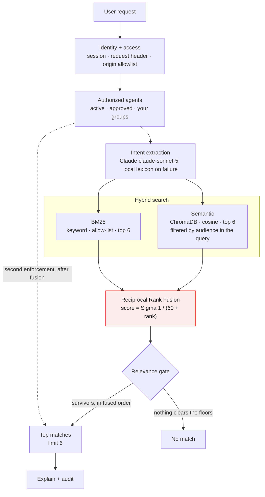

# Agent search: query flow

One request through `POST /api/marketplace/search`, exactly as the code runs it.
Permission is applied before anything is scored and enforced again after it;
the language model only restates the question; two retrievers are fused by
rank; everything after fusion removes results and never reorders them. The numbers are the live
constants. A published page version of this diagram is kept alongside the
review materials.

## What each stage does, and what it falls back to

| Stage | Behaviour | If it fails |
| --- | --- | --- |
| Session boundary | Custom header required; Origin must be on the allowlist, the Render URL, or any loopback port outside production. | `403` naming the reason; `401` without a session. |
| Visible catalogue | Filtered per user before any scoring, and pushed down into retrieval: the vector query carries a `$contains` filter on the agent's audience, and BM25 scores only permitted ids. Both indexes still hold the whole catalogue and are shared. | Nothing impermissible is retrieved in the first place, and the post-fusion drop still runs as a second enforcement. |
| Understand | Claude returns a restatement plus domains and capabilities, intersected with the real catalogue so it cannot invent a category. It never picks an agent. | Local lexicon produces the same shape. Any Claude failure lands here. |
| Semantic retrieval | Agents embedded once at start, keyed by a content fingerprint; only the query is embedded per search. About 0.5 s on Render's free tier. | Index broken or empty → keyword-only. |
| Keyword retrieval | BM25 over the same text the semantic index embeds, so a ranking difference is a difference in method, not input. | Rebuilt in microseconds from the catalogue. |
| Fusion | Ranks, not scores: a cosine in 0–1 and a BM25 in 0–10 never meet as magnitudes. `k = 60`. | — |
| Relevance gate | RRF always returns something, so the gate decides what is shown. Calibrated on this catalogue: real matches 0.54–0.85, noise 0.35–0.47. Retune when the model or the catalogue changes. | No match, with next steps. |
| Explain | "Why this matched" names the agent's own metadata the request asked for. Not generated prose. | Percentage omitted rather than invented. |
| Footprint | Enough to reconstruct the ranking afterwards. Readable at `GET /api/context/events`, scoped to the user. | A test asserts ranking is identical before and after a user acts. |

## Three properties to state in the review

- **Permission first, never after.** The visible set is computed at step three. Scoring only ever sees agents the person may use; the dotted edge is the guarantee.
- **The model understands; the registry decides.** Claude produces a `SearchIntent` and nothing else. Owner, status, access and URLs come from `agents.json` alone.
- **Every step degrades.** No key → lexicon. Timeout → lexicon. Broken index → keyword only. Nonsense → no match. The demo has no single point of failure.

Constants: candidates 6 (per audience) · k 60 · floors 0.45 / 65% / 50% · limit 6 · intent cache 256 · retrieval cache 256 · model `claude-sonnet-5` · index ONNX MiniLM-L6-v2.
