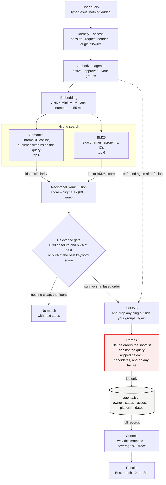

# Agent search: query flow

```
User Query  →  Embedding  →  Hybrid Search  →  Rerank  →  Context
```

One request through `POST /api/marketplace/search`, exactly as the code runs it.
Nothing interprets the query before retrieval: it is embedded as typed, so what
you search for is what you asked for and the same words return the same agents
every time. A model reads the request once, at the rerank, where it judges
candidates against the query rather than rewriting the query. Permission is
applied before anything is scored and enforced again after. The numbers are the
live constants.



## What each stage does, and what it falls back to

| Stage | Behaviour | If it fails |
| --- | --- | --- |
| Identity + access | Custom header required; Origin must be on the allowlist, the Render URL, or any loopback port outside production. | `403` naming the reason; `401` without a session. |
| Authorized agents | Computed before any scoring, and pushed into retrieval: the vector query carries a `$contains` filter on the agent's audience, and BM25 scores only permitted ids. | Nothing impermissible is retrieved at all, and the post-fusion drop still runs as a second enforcement. |
| Embedding | The query as typed. Agents were embedded once at startup, keyed by a content fingerprint, so a restart re-embeds nothing. | Index broken or empty → keyword-only. |
| Hybrid search | Two rankers over the same agent text. Semantic finds meaning, BM25 finds `W-8`, `OFSI`, `AHR` and exact names — measured, semantic alone misses those three entirely. | Either side can return nothing; the other still answers. |
| Fusion | Ranks, not scores: a cosine in 0–1 and a BM25 in 0–10 never meet as magnitudes. `k = 60`. | — |
| Relevance gate | RRF always returns something, so the gate decides what is shown. Floors are set for a bare query: a short question scores far lower than an expanded one for the same meaning. | No match, with next steps. |
| Rerank | Fusion orders by agreement between two retrievers, which is a proxy for relevance, not a judgement about it. This compares each candidate with the request. Measured: reordered 3 of 8, fixed 1, broke 0. | Fused order stands, untouched. A reranker that cannot run never costs a user their results. |
| Context | Retrieval returns ids and numbers only. Every field on screen — owner, status, access, dates — is read from `agents.json` after the id comes back. | — |

## Three properties to state in the review

- **Permission first, and again after.** The visible set is computed before scoring and filters inside the vector query; the dotted edge is the second enforcement. A retrieval fault cannot surface an agent someone may not see.
- **The query is never rewritten.** No model stands between what was typed and what was searched. The one model call judges candidates against the request, and if it fails the results still come back.
- **`agents.json` is the record of truth; the index is derived.** Delete the index directory and you lose a rebuild, nothing else. Owner and access can never be stale, because they are read fresh from the catalogue every request.

Constants: candidates 6 per ranker · RRF k 60 · floors 0.30 / 65% / 50% · limit 6 · retrieval cache 256 · index ONNX MiniLM-L6-v2 · reranker `claude-sonnet-5`.

Latency, measured end to end: **66 ms** when nothing needs reranking, **1.9–3.5 s** when it does.
